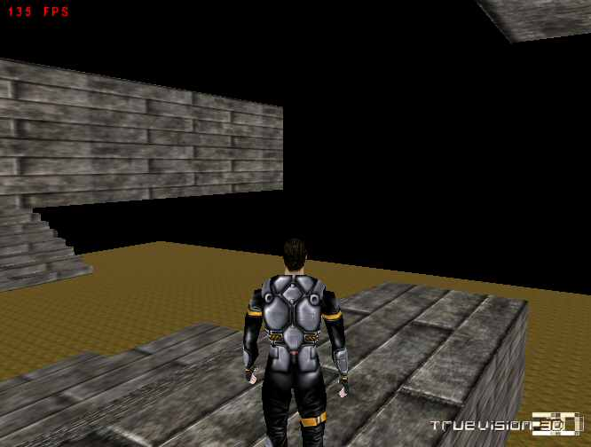



## Collison for 3rd Person View \(with Jump\)

### Description

I hope u can use this. I took this out directly from my game.

I took alot of stuff that u don't need out. For example Automated Mesh loading.

You are free to use any of this code but if u use the camera code plz

at least tell me.

All of the collision Code are in the Actor_Mod module.

The sub WalkoverMesh in that module makes the actor walk on the wall.

Add when ever he presses left or right the sub Actor_Pressed_Up gets activated.

And There it checks all the collision and thats kinda it.

If u have any question or suggestion email me.
 
### More Info
 
NOTE!!!!

You are required to have TV 6 Final. Download from http://www.truevision3d.com

Either the Lite version or full version will do.

Download Full version if you want to learn TV3D since it contains a lot of samples and tutorials.

             |
---                |---
**Submitted On**   |2003-08-14 11:49:36
**By**             |[errrRus](https://github.com/Planet-Source-Code/PSCIndex/blob/master/ByAuthor/errrrus.md)
**Level**          |Beginner
**User Rating**    |5.0 (25 globes from 5 users)
**Compatibility**  |VB 5\.0, VB 6\.0
**Category**       |[Games](https://github.com/Planet-Source-Code/PSCIndex/blob/master/ByCategory/games__1-38.md)
**World**          |[Visual Basic](https://github.com/Planet-Source-Code/PSCIndex/blob/master/ByWorld/visual-basic.md)
**Archive File**   |[Collison\_f1629708142003\.zip](https://github.com/Planet-Source-Code/errrrus-collison-for-3rd-person-view-with-jump__1-47709/archive/master.zip)

